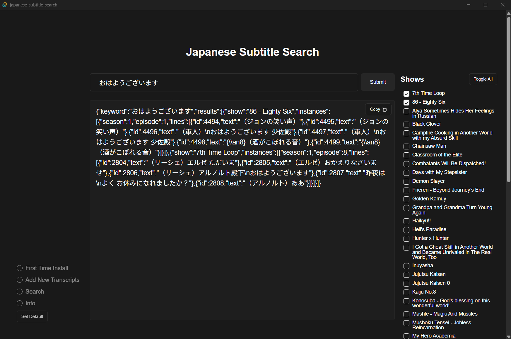

# Rust + Solid via Tauri

This project makes use of Rust for fast and efficient transcript processing, and Typescript + SolidJs for the frontend. It uses an sqlite database for storage.

## Getting Started

To start the development server, run:

```bash
cargo tauri dev
```

The general idea is that you parse the transcript files and write them to a csv. That csv is read by [ichiran](https://github.com/tshatrov/ichiran) using a custom script for parallel processing. That is output to another csv which this program finally reads and writes to a local sqlite database, creating reverse indexes for extremely fast word searches.

After that, you can just search for whatever word you want and it'll give you instant results.

More detailed setup instructions are provided in the application UI. Please refer to the app for specific configuration steps and troubleshooting tips.

## Recommended IDE Setup

- [VS Code](https://code.visualstudio.com/) + [Tauri](https://marketplace.visualstudio.com/items?itemName=tauri-apps.tauri-vscode) + [rust-analyzer](https://marketplace.visualstudio.com/items?itemName=rust-lang.rust-analyzer)

## Additional Notes

Transcript file names must contain seasons and episodes formatted like such:

- S01E01
  ('S' followed by any number of digits and 'E' followed by any number of digits; the file names can have any surrounding text you want)
- ShowName.S03E134.EpisodeName would be fine :)

There's some limited support for other formats but they require exceptions. See episode_info.rs and show_configs.rs files to add more.

## License

[MIT](LICENSE)
